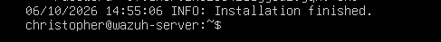
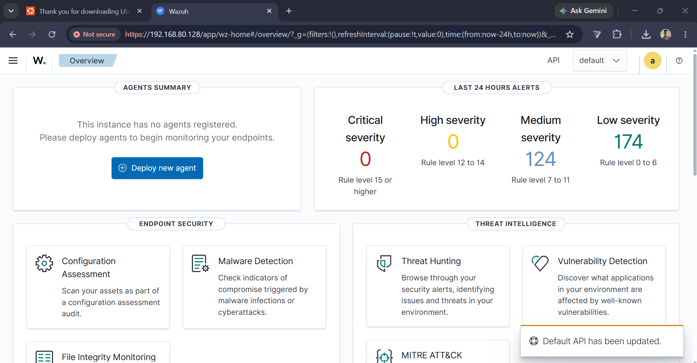

# Wazuh SOC \& SIEM Home Lab


## Overview


This project documents the deployment and configuration f a Wazuh based security operations centre (SOC) lab designed to provide some hands on experience with security monitoring, log analysis and detection engineering.


this labs consists of a Wazuh SIEM server running on ubuntu server and a windows 11 endpoint(both virtual machines) monitored using the Wazuh agent. Controlled security events were generated on the windows endpoint and were analysed through the Wazuh dashboard, this demonstrated how endpoint activity can be collected, detected and investigated within a SIEM (Security Information and Event Management)


The projet Covers:


&#x20;- Deploment of a Wazuh SIEM environment

&#x20;- Windows endpoint integration and security event collection

&#x20;- detection and investigation of failed authentication attempts

&#x20;- Monitoring of windows account creation and modification

&#x20;- Real-Time Files integrity monitoring (FIM)

&#x20;- analysis of file integrity chanes using cryptographic hashes

&#x20;- MITRE ATT\&ack mapping of detected acivity

&#x20;- development and validation of a custom Wazuh detection rule

&#x20;- escalation of a monitored file modification to a custom level 12 alert


the overall objectives of this project was to achieve more that simply installing a SIEM and demonstrate a complete detection workflow.


## Lab Deployment


The Wazuh was Deployed on an Ubunter server virtual machine to provide the centralised security monitoring and analysis





following the installation, the Wazuh dashboard was accessed successfully and confirmed to be operational.





## Lab ARchitecture


the lab was built using VMware Workstation and consists of two virtal machines that were connected using the NAT virtual network.


### Wazuh server


&#x20;- \*\*operating system:\*\* ubuntu server 24.04 LTS

&#x20;- \*\*Role:\*\* Wazuh manager, indexer and dashboard

&#x20;- \*\*Resrouces:\*\* 4 CPU cores, 8gb RAM, approximately 50gb of storage

&#x20;- \*\*Network:\*\* VMware NAT

&#x20;- \*\*Lab IP:\*\* '192.168.80.128'


### windows endpoint


&#x20;- \*\*Operating system:\*\* Windows 11 Pro

&#x20;- \*\*Role:\*\* Monitored endpoint used to generate controlled security events

&#x20;- \*\*Wazuh agent:\*\* 4.14.8

&#x20;- \*\*Network:\*\* VMware NAT

&#x20;- \*\*Lab IP:\*\* '192.168.80.129'


the wazuh agent installed on the windows enpoint collected the security teletry and forwars it to the server for analysis. Wazuh rues are then used to identify if there are any potentially signifigant activity proceeds to generate alerts for investigation.


### Architecture


```text

┌─────────────────────────────┐

│      Windows 11 Endpoint    │

│       WIN-ENDPOINT1         │

│                             │

│  Windows Security Events    │

│  File Integrity Monitoring  │

│  Wazuh Agent                │

└──────────────┬──────────────┘

&#x20;              │

&#x20;              │ Security Telemetry

&#x20;              ▼

┌─────────────────────────────┐

│        Wazuh Server         │

│      Ubuntu Server 24.04    │

│                             │

│  Wazuh Manager              │

│  Wazuh Indexer              │

│  Wazuh Dashboard            │

│  Detection Rules            │

└──────────────┬──────────────┘

&#x20;              │

&#x20;              ▼

&#x20;      Alerts \& Investigation


## Security Deteciton Scenarios


### 1. detection of failed Authentication


to test the windows authentication monitoring, multiple controlled loggin attempts were done on the windows 11 endpoint using an incorrect password.


the failed authentication attempts were recorded y the windows security event logs and collected by the Wazuh agent, within the wazuh dashboard - threat hunting, the activity generated multiple authentication failure alerts.


the test successfully produced

&#x20;- \*\*9 Authentication failure alerts\*\*

&#x20;- Wazuh rule ID: '60122'

&#x20;- Severity: \*\*Level 5\*\*

&#x20;- Description: 'Logon Failure - Unknown user or bad password'

&#x20;- Source endpoint: 'WIN-ENDPOINT1'


!\[Failed authentication alerts](screenshots/04-failed-authentication-detection.png)


this test was able to demonstrate the ability to monitor multiple repeated authentication failures from a window endpoint and investigate the resutlign events centrally through the wazuh SIEM.


the repeated authentication failures could represent a legitimate user failing to access their account, but it could also indicate someone or somthing guessing a password or brute force activity. in a production SOC environment, additional context such as the source address, the targeted account, the frequency and the timeframe would be investigated before deciding wethre any escalation was needed.


\### 2. windows account creation and modification


to test the account management monitoring, a new local windows named 'TestSOCUser' was created on the monitored windows endpoint.


windows generated account management security events which were collected by the Wazuh agent and anaysed by the server, it generatedmultiple alerts replating o the creation, enabling and modification of the accounts.


the activity that was produced:

&#x20;- Waxuh rule ID: '60109' - 'User account enabled or created'

&#x20;- Wazuh Rule ID: '60110' - 'User account changed'

&#x20;- Severity: \*\*Level 8\*\*

&#x20;- Source endpoint: 'WIN-ENDPOINT1'


!\[Windows account management alerts](screenshots/05-account-creation-alerts.png)


detailed anyssis of the eetns identief the test account 'TestSOCUser' within the windows account-management telementry.


!\[Account creation event details](screenshots/06-account-creation-event-details.png)


wazuh also mapped the detected activity to the MITRE ATT\&CK framework:


&#x20;- \*\*Technique:\*\* T1098 - Account manipulation

&#x20;- \*\*Tactics:\*\* Persistence


!\[Account manipulation MITRE ATT\&CK mapping](screenshots/06b-account-creation-mitre-details.png)


both account creation and modification are important events to monitor as unauthorsed account can potentially be used to maintain access to a compromised system, in a real production SOC environment, an anlysts would investigate wether the account creation was authorised, then potentially identify the user or process that was responsible, review associated authentication activity and determin wether the account should be left alone or disabled/removed.


following validatin of the detection, the test account was no longer needed and removed from the endpoint as part of the lab clean up process.


\### 3. File integrity monitoring


wazuhfile integrity monitoring (FIM) was configure to monitor a dedicated directory on the windows endpoint in real time


'C:\\SOC-Lab\\Monitored'


the wazuh agent configuration was modified to enable real time monitoring and change reporting for the directory, a test file named 'important.txt' was then created and subsequently modified to generate contolledfile-integrity events.


wazuh sucesfully detecte both stages of activity:


&#x20;- \*\*Rule 554\*\* - 'File added t the system' - Level 5

&#x20;- \*\*Rule 550\*\* - 'integrity checksum changed' - level 7

&#x20;- monitoring mode: \*\*Real-time\*\*

&#x20;- Source endpoint: 'WIN-ENDPOINT1'


!\[File Integrity Monitoring alerts](screenshots/07-fim-alerts.png)


further investigation f the rule 550 alert showed taht the wazuh recorded changes t several file attributes, including:


&#x20;- file size

&#x20;- Modification time

&#x20;- MD5 hash

&#x20;- SHA-1 hash

&#x20;- SHA-256 hash


the alert contained both the previous and updated cryptographic hashes, allowing the integrity change to be verified


!\[File integrity change details](screenshots/08-fim-integrity-details.png)


the Wazuh mapped the detected activity to the MITRE ATT\&CK framework:


&#x20;- \*\*Technique:\*\* T1565.001 — Stored Data Manipulation

&#x20;- \*\*Tactic:\*\* Impact


the test demostraed how file integrity monitoring can identify unexpected changes to monitored files, in a production enviromnet this capability can be used to help identiy if there is any unauthorised modification or configuration files, scripts, application files or other security-sensitive data.


an anayst that is investigating such an alert would determin what changed, identify the user or process responsible for the modification, establish wether the activity was authorised and compare the event with other endpint telementy before decding wether any escalation or remediation is needed.


\### 4. custom detection engineering


after validation the wazuh's vuilt in file integrity capabilies, a custom detection rule was developting to demonstrate environment-specifc detection engineering.


the objective was to increase the severity of an alert when the specifically monitored file 'important.txt' was modified


wazuh's built-in rule 550 detects a file integrity checksum change at level 7, a customer child rule was created to identify when rule 550 was triggered specically for:


'C:\\SOC-Lab\\Monitored\\important.txt'


the custom rule was configured as:


&#x20;- \*\*Customer rule ID:\*\* '100002'

&#x20;- \*\*Severity:\*\* Level 12

&#x20;- \*\*Parent Rule:\*\* '550'

&#x20;- \*\*Custom Group:\*\* 'custom\_fim'

&#x20;- \*\*Detection File:\*\* 'important.txt'


the custom detection logic is stored seperatly in:


'detection-rules/custom\_fim\_rle.xml'


the rule uses wazuhs existing FIM detection as its parent and it applies addition logic to identify modification of the designated file:


```xml

<group name="local,syscheck,">


&#x20; <rule id="100002" level="12">

&#x20;   <if\_sid>550</if\_sid>

&#x20;   <field name="file">C:\\\\SOC-Lab\\\\Monitored\\\\important.txt</field>

&#x20;   <description>Custom SOC Alert: Critical monitored file modified - important.txt</description>

&#x20;   <group>custom\_fim,critical\_file\_modified,</group>

&#x20; </rule>


</group>


before retating the Wazuh manager the rule configuration was validated to ensure that thenew detection logic did not introduce configuration errors.


a second controlled modification was then made to important.txt, and the Wazuh successfully matched the underlying FIM event agains the custom rule and generated the following alert:

&#x20;- \*\*Rule ID\*\* 100002

&#x20;- \*\*severity:\*\* Level 12

&#x20;- \*\*Description:\*\* Custom SOC Alert: Critical monitored file modified - important.txt

&#x20;- \*\*Detection mode:\*\* Real-time


&#x20;!\[Custom rule Alert](09-custom-rule-alert.png)


this demonstrates how generic security telemntry can be transformed into environment-specific detection logic, rather thatn treating every file modification with the same severity a SOC can identify particularly sensitive files or systems and increase the priority of alerts affecting tose assests.


the successful test demonstrated the complete detcion-engineering workflow:


Identify Relevant Telemetry → Develop Detection Logic → Validate Configuration → Generate Test Activity → Confirm Alert → Investigate


\## troubleshooting \& lessons learned


several issues were encountered during the deployment and the testing process, troubleshooting these probles provided additional practical experience with wazuh, windows event collection and SEIM administration.


\### windows agent configuration 


the windows wazuh agent initially dialed to start correctly because the manager address was configured as '0.0.0.0'. the agent logs were reviewed to identify the issue, and the configuration was corrected to point to the correct ip that related to the wazuh servr, after restarting the service the endpoint was successful connected and appeared as active within the dashboard.


\### windows event investigation


during account-management testing, windows generated the expected local security events but they were initially difficult to locate within wazuh using field-specifc searches. the investigation involved verifying the windows security event log, confirimg that the wazuh service was indeed running, reviewin the agent configuration and checking the wazuh agent logs.


the events were ultimately located through broader threat huntering searches, this highlights the importance of understanding both the underlying telemetry and the SIEM's sear/indexing beahiour when investigating an alert.


\### File integrity Monitoring


the Wazuh agentcofigruing was modified to enable real time monitoring of a dedicated windows directory. after the configuarion change, agent logs and service status was checked to verify that file integriy monitoring had initialised corelty before generating test activity.


\### custom rule development


before activating the custom detection rule, the wazuh analysis configuration was validated to reduce the risk of introducing an invalid rule into the running environment, the wazuh manager was then restarted and its service status was verified before the custom detection was tested.


overall, thetroubleshootin process reinforced the importance of validation each stage of the telemetry pipeline:


\*\*Event Generation → Endpoint Logging → Agent Collection → Manager Processing → Rule Matching → Alert Investigation\*\*


\## Skills Demonstrated


This project provided practical experience with:


\- SIEM deployment and administration

\- Wazuh Manager, Indexer and Dashboard

\- Windows endpoint monitoring

\- Windows Security Event Logs

\- Security event investigation

\- Threat hunting

\- File Integrity Monitoring

\- Cryptographic file hashes

\- Custom SIEM detection rules

\- Alert severity tuning

\- MITRE ATT\&CK mapping

\- Linux administration

\- PowerShell

\- VMware virtualisation

\- Network troubleshooting

\- Detection engineering

\- Technical troubleshooting and validation


\## in concluding this project demonstrated the deployment and practical use of a wazuh SIEM environment rather than simply completing and installation, multiple controlled security events were generated, detected an investigated, including authentication failures, windos account-management and file-integrity changes.


the project the extended the wazuhs built in detection capabailities by implementing and validating a new custom detection rule that escalated modifications of a designated monitored file to a level 12 alert.


the completed lab demonstrates an end-to-end security monitoring workflow covering endpoint telemettu collection, SIEM analysis, threat investigation, MITRE ATT\&CK contextualisation and custom detection engineering.

